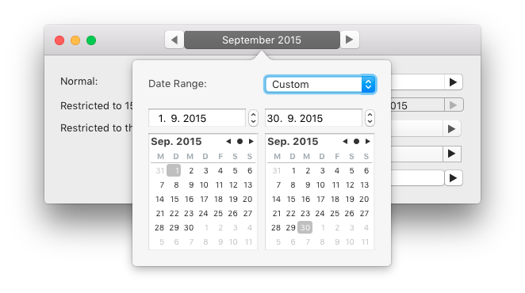
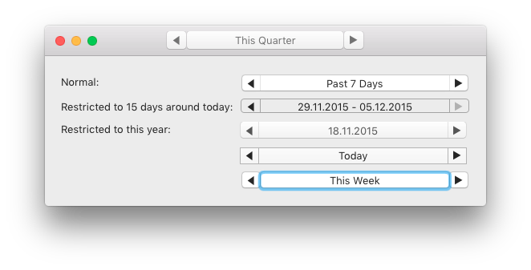
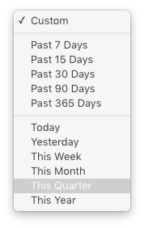

# DateRangePicker - the best (?) date range picker control for OS X

(At least I don't know of any better. If you do, please tell me.)

## Usage

Just drag the date range picker onto your Storyboard or Nib. It looks particularly good in the toolbar with segmentStyle = .Separated. If you wish to center the picker in the toolbar, I can recommend using [TAAdaptiveSpaceItem](https://github.com/timothyarmes/TAAdaptiveSpaceItem).

You can observe changes in the date range by key-value-observing startDate and endDate and/or setting a target and action on the DateRangePickerView control.

## Features

- Perfect for use in a toolbar, but can also be used anywhere else
- Date range presets: "Last 7/15/30/90/365 days", "Today/Yesterday/This week/month/quarter/year"
- Pretty display of these presets as well as previous/future months (as e.g. "October 2015")
- "Back" and "Forward" buttons let you shift the date range by its current duration, e.g. 7 days earlier/later, previous/next month/week/quarter/year
  - I.e. "real" month-by-month stepping through the data, not in simple 30-day intervals
- Completely custom date ranges selectable in a popover (which can be used without the control as well)
- Lets you specify minimum and maximum dates that can not be exceeded
  - These are reflected in the interface - the "Back"/"Forward" buttons get disabled when the date range reaches the minimum/maximum
- Provides a sophisticated, serializable (so you can persist it between launches of your app) date range structure (implemented as a Swift enum)
- Provides some useful date computation functions as an extension to NSDate
- Usable from Objective-C
  - Exposes KVO/KVC-compatible startDate and endDate properties
  - Date range changes are also sent via NSControl's target-action pattern
  - Exposes -dateRangeAsData and -loadDateRangeFromData: methods that let you persist the date range in Objective-C as well
  - The NSDate extensions are also available from NSDate
- Customizable segmented control styles
- Localizations: English, German (feel free to add others!)
- High code quality
  - Adheres to Cocoa "Best Practices" (if you find any antipatterns, let me know)
  - Full test coverage for the date range structure and date computations
- Interface Builder-compatible (@IBDesignable)
- Small and self-contained

## What's missing

- The date presets can currently not be customized (but you can easily replace them in ExpandedDateRangePickerController)
- Date presets for "Last month/week/quarter/year" and "Next month/week/quarter/year" are currently not available (but could be added easily, and you can still reach them by selecting "This week/month/quarter/year" and then pressing "Back"/"Forward")
- Found something else? Submit a pull request or contact me :-)

## Compatibility

Requires (and tested on) OS X 10.9 or later. Looks a lot better in the toolbar with OS X 10.10 ;-)

### Notes for legacy Nibs

If your Nib uses the old initWithFrame: initialization or is deflated on OS X 10.9, there is a bug with custom views in NSToolbar. This results in the date range picker's frame not being initialized correctly. In order to avoid this, I recommend the following procedure:

- Create a dummy NSToolbarItem with an empty Custom View of the desired size and add an IBOutlet for the NSToolbarItem
- Add the picker as a standalone view to the Nib and add an IBOutlet for it as well
- In -awakeFromNib, programmatically set the toolbar item's view to be the picker

## License

This library is available under the [ISC license](http://choosealicense.com/licenses/isc/), which is a simplified variant of the two-clause BSD license.

If you use this library, I appreciate if you let me know [@daniel\_a\_a](https://twitter.com/daniel_a_a) on Twitter. I also have a [blog](https://danielalm.de).
